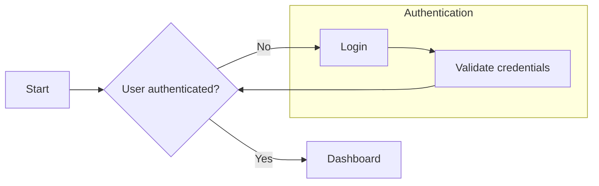
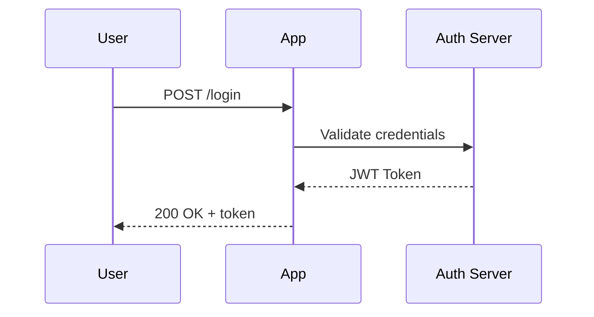
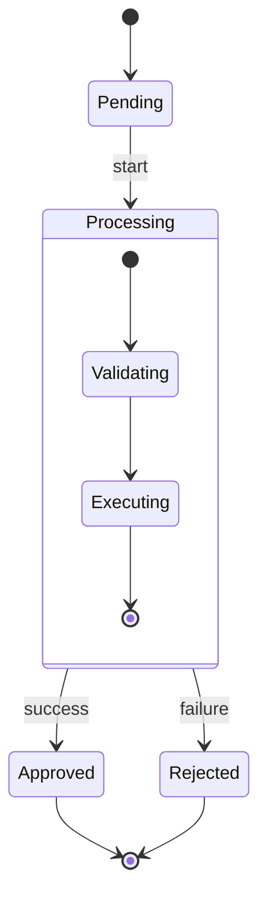
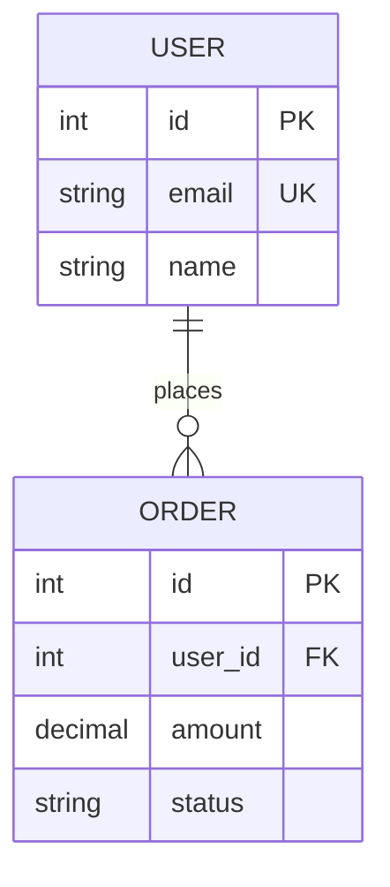
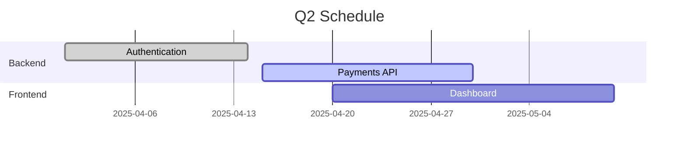

# meta:mermaid-creator

Produces syntactically valid Mermaid.js diagrams that render without errors on GitHub,
Notion, GitBook, MkDocs, and the Claude artifact environment. Prevents the most common
silent failures — labels without quotes, emojis, `end` as node text — that produce a
blank screen with no useful error message.

## Discovery

**1. Diagram type**
Which structure does the user want to represent?

| Intent                           | Mermaid type      |
|----------------------------------|-------------------|
| Process with decisions           | `flowchart`       |
| Message exchange between systems | `sequenceDiagram` |
| Entity lifecycle                 | `stateDiagram-v2` |
| Database model                   | `erDiagram`       |
| Project schedule                 | `gantt`           |
| OOP class structure              | `classDiagram`    |
| Set proportions                  | `pie`             |

**2. Direction**
For flowcharts: `LR` (left→right) for horizontal flows and pipelines;
`TD` (top→down) for hierarchies, trees, and vertical flows.

**3. Complexity and scope**
Approximately how many nodes/actors/entities? Diagrams with more than 20 nodes become
illegible — suggest splitting into subdiagrams if needed.

**4. Render target**
GitHub, Notion, GitBook, `.mermaid` file, or inline in chat? Affects delivery format
(code block vs file).

## Production rules

### Mandatory opening — type on the first line

```
flowchart LR
sequenceDiagram
stateDiagram-v2
erDiagram
gantt
classDiagram
pie title Distribution
```

The type must be the first line of the block — no comments or whitespace before it.

### Rules by type

**flowchart / graph**



Critical rules:

- Labels with spaces, commas, parentheses, or special characters: **always in quotes**
  `A["Label with space"]` — without quotes the parser fails silently
- `end` as node text breaks the parser — use `finish`, `done`, `End`, `Terminate`
- Subgraphs: `subgraph id["Label"] ... end` — `end` is a reserved keyword here, not node text
- No emojis anywhere

**sequenceDiagram**



Rules:

- `participant X as Alias` for labels with spaces
- `->>` synchronous, `-->>` response, `--)` asynchronous
- No `Note` before declaring the corresponding `participant`
- Activate/deactivate with `activate`/`deactivate` — do not nest more than 2 levels

**stateDiagram-v2**



Rules:

- Initial state: `[*]` — not `start` or `initial`
- Always `stateDiagram-v2` — v1 has different and limited syntax
- Composite states with `state Name { ... }`

**erDiagram**



Cardinalities: `||--||` (1:1), `||--o{` (1:N), `}o--o{` (N:M)

**gantt**



Rules:

- `dateFormat` mandatory before any task
- Status: `done`, `active`, `crit` (critical) — optional

### Delivery

Simple diagrams (< 30 lines): deliver as ` ```mermaid ` block inline in chat — renders visually.
Complex diagrams: save to `/mnt/user-data/outputs/[name].mermaid` and call `present_files`.

## Validation

<checklist>

**General syntax**

- [ ] Diagram type declared on the first line of the block
- [ ] No emojis anywhere
- [ ] No `end` as node text in flowchart — only as subgraph closing keyword
- [ ] Labels with spaces, commas, or parentheses enclosed in double quotes

**By type**

- [ ] flowchart: direction declared (LR, TD, RL, BT)
- [ ] stateDiagram: version `stateDiagram-v2`, not `stateDiagram`
- [ ] stateDiagram: initial state `[*]`, not `start`
- [ ] sequenceDiagram: `participant` declared before `Note` for the same actor
- [ ] erDiagram: cardinalities using correct notation (`||--o{`, etc.)
- [ ] gantt: `dateFormat` declared before the first task

**Readability**

- [ ] Diagram has at most ~20 nodes — if more, split or justify
- [ ] Subgraphs used to group related nodes when there are > 8 nodes

**Negative assertions**

- [ ] No emoji in Mermaid code
- [ ] No label with special characters without quotes
- [ ] No `stateDiagram` (v1) — only `stateDiagram-v2`

</checklist>
